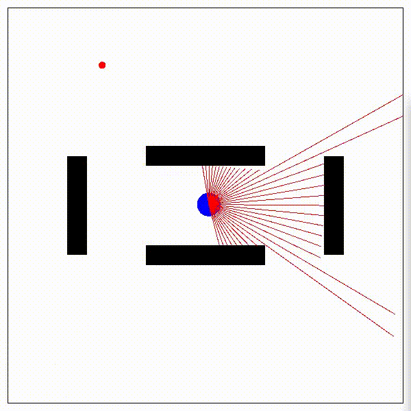

# Navigation Simulator for Mobile Robot

[](https://www.python.org)
[](https://travis-ci.com/Jumpei-Arima/Navigation_Simulator_for_Mobile_Robot)
[](https://coveralls.io/github/Jumpei-Arima/Navigation_Simulator_for_Mobile_Robot?branch=master)
[](https://github.com/Jumpei-Arima/Navigation_Simulator_for_Mobile_Robot)



## Installation
NSMR can be installed by using `pip`.

```
$ pip install nsmr
```

If installing from source code, execute the following commands.
```
$ git clone https://github.com/Jumpei-Arima/Navigation_Simulator_for_Mobile_Robot
$ cd Navigation_Simulator_for_Mobile_Robot
$ pip install -e .
```

For examples see example
```
python examples/run_env.py
```
